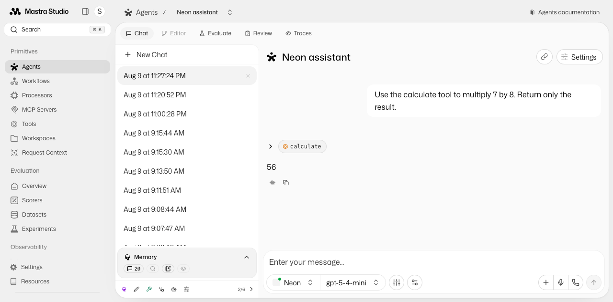

# Mastra Studio on Neon

Self-host [Mastra Studio](https://mastra.ai/docs/getting-started/studio) with Neon.

- [Neon Functions](https://neon.com/docs/compute/functions/overview) serves the Mastra API and proxies the Studio SPA.
- [Neon Object Storage](https://neon.com/docs/storage/overview) holds the static Studio assets.
- [Neon AI Gateway](https://neon.com/docs/ai-gateway/overview) runs the example assistant.
- [Lakebase Postgres on Neon](https://neon.com/docs/introduction/neon-and-lakebase) stores memory, logs, traces, and metrics.
- [Mastra SimpleAuth](https://mastra.ai/docs/server/auth/simple-auth) protects Studio and all non-auth Mastra API routes.



## Architecture

```text
Browser ──▶ Neon Function ──▶ Object Storage (Studio assets)
                       ├────▶ AI Gateway (model calls)
                       └────▶ Lakebase Postgres
                              ├─ public schema (memory)
                              └─ mastra_observability schema (logs, traces, metrics)
```

The Studio bucket is public-read because it contains only static Studio assets. The Function keeps protected API routes behind authentication.

## Deploy

Prerequisites:

- [Bun](https://bun.sh/)
- [Neon CLI](https://neon.com/docs/reference/neon-cli)
- A Neon project on the [Launch or Scale plan](https://neon.com/docs/ai-gateway/overview#pricing), in AWS US East (Ohio) (`aws-us-east-2`)

Install dependencies and create the two deployment settings:

```bash
bun install
cp .env.example .env.deploy
```

Keep the two custom settings in `.env.deploy`; `neon deploy` writes Neon-generated service credentials to `.env.local`. Set `MASTRA_STUDIO_TOKEN` to a random value, for example from `openssl rand -hex 32`.

Load the settings, then link the checkout to the target Neon project and branch:

```bash
set -a
source .env.deploy
set +a
neon link
neon checkout main
```

Provision Postgres, Object Storage, Functions, and AI Gateway:

```bash
neon deploy --env .env.deploy
```

Upload the installed Mastra Studio build:

```bash
bun run studio:upload
```

Run `studio:upload` again after changing the `mastra` package version; the assets come from the installed package.

Open the Function URL printed by `neon deploy`, then sign in with:

```text
Email:    any value (SimpleAuth ignores it)
Password: the MASTRA_STUDIO_TOKEN value
```

## Local development

```bash
set -a
source .env.deploy
set +a
neon dev
```

Studio runs at `http://localhost:8787`.

## Included example

The Studio exposes:

- one memory-enabled assistant
- `calculate`, `get-current-time`, and `get-database-time` tools
- persisted logs, full trace trees, and automatic model/agent metrics

## Verify

```bash
bun run typecheck
bun run test
curl http://localhost:8787/health
```

Unauthenticated requests to protected `/api/*` routes and `/refresh-events` return `401`.
Mastra authenticates the routes it registers. Custom routes must check `auth.getCurrentUser` explicitly, as `/refresh-events` does.

## Production boundaries

- SimpleAuth is a shared-token example, not multi-user authentication.
- Each open Studio tab holds an SSE Function invocation. Neon Functions default to [100 concurrent invocations per account](https://neon.com/docs/compute/functions/reference/runtime-limits#concurrency).
- Observability uses a separate schema in the application database, not a separate database. Each live Function isolate can open up to five Postgres connections.
- Traces can include prompts and model output. Configure redaction and retention for your data policy; this example does not add a retention job.
- Functions, Object Storage, and AI Gateway are [beta services not yet recommended for production workloads](https://neon.com/docs/get-started/backend-beta).
- The Mastra packages are pinned alpha releases because the observability APIs used here are not yet stable.
